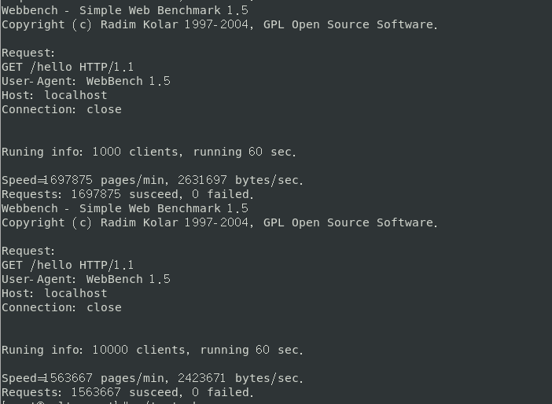

# 压力测试

* 压力测试分为单机测试、服务器平台测试，同时与muduo网络库中的httpserver进行了性能对比
* 测试采用的是WebBench，同时分别模拟了100，1000，10000的并发，测试时间60s，短连接
* 全部都是部署在centos7，测试时关闭所有输出与日志，为了简单起见响应内容全为“hello world”加上必要的请求头，为了测试上万的并发连接修改最大可打开的文件描述符10240

## 单机测试
* 环境：centOS7 4核 8G
* 线程： 8

* WebServer

QPS：1000000+

* muduo

QPS：1000000+

## 网络测试
* 服务器
* 环境：CentOS7
* 线程：8

* 客户端
* 环境：CentOS7 4核 8G

* WebServer

QPS：

* muduo

QPS：
